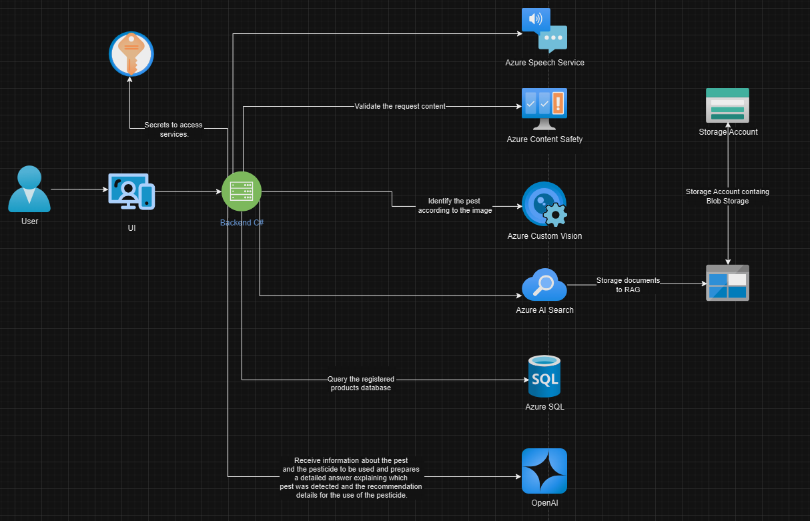

# hackathon-microsoft-agro

## Briefing

The application implements several jobs related to agriculture planning based on the Brazilian regulation. The current application is written in Python and C# which calls an AI language model to help the farmer to make an agriculture plan and take care of his crops. The Brazilian regulation, dosage limits and restrictions for pesticide use will be uploaded to a database that will serve the AI language model. The AI model will be fed with tables with seed information, fungicides, herbicides and pesticide efficiency and soil fertility recommendations from historical documentation and recent reports for different locations. The application also has a computer vision model to identify infestation by insects or diseases based on the images, and this information is used by the language model to suggest efficient pesticides in accordance with Brazilian standards for control. Searches always returned sources for verification and warnings about AI's limitations. 

**All recommendations must be made by a qualified professional and an agronomic prescription must be issued for the purchase of pesticides. AI can only assist in the search for information.**

The main goal is to (i) reduce the use of pesticides with increased efficiency and (ii) give to the farmer information to create agriculture planning and reports for the government and to use it on investment search.

## Solution Architecture

#### User and User Interface (UI):
- The user interacts with the user interface (UI) written in Python.

#### Backend C#:
- The UI communicates with the backend developed in C#, which manages business logic and integration with other Azure services.

#### Azure Key Vault:
- The backend uses secrets stored in Azure Key Vault to securely access other Azure services.

#### Azure Speech Service:
- The Azure Speech Service can be used to convert audio to text, if necessary.

#### Azure Content Safety:
- The content of the request is validated by Azure Content Safety to ensure there is no inappropriate content.

#### Azure Custom Vision:
- The backend sends the pest image to Azure Custom Vision, which identifies the pest in the image.

#### Azure SQL:
- The backend queries the database of products registered with the Ministry of Agriculture and Livestock to obtain information about pesticides for specific crops and pests.

#### Azure AI Search:
- Documents are stored in a storage account and indexed by Azure AI Search to facilitate the retrieval of relevant information.

#### OpenAI:
- The OpenAI service receives information about the pest and the pesticide and prepares a detailed response explaining which pest was detected and recommending details about the use of the pesticide.

#### Document Storage:
- Documents are stored in a storage account containing Blob Storage and are used by Azure AI Search.

## Opportunity statement

The Brazilian agribusiness GDP in 2024 is projected to reach R$2.50 trillion ($415 billion), with R$1.74 trillion ($290 billion) coming from the agricultural sector and R$759.82 billion from the livestock sector. According to the Brazilian Confederation of Agriculture and Livestock (CNA), the share of agribusiness in Brazilian GDP in 2024 is estimated at 21.8%. The importance of agribusiness in the Brazilian economy is an opportunity for studies and implementation of applications that can upgrade productivity.

This project aims to develop an AI-powered assistant tailored to the Brazilian agricultural sector, adhering to local legislation. The assistant will leverage AI Search combined with RAG to enhance the accuracy and relevance of information to facilitate the work of agricultural professionals. The main set of features of this application includes:

Data Retrieval: Utilize RAG to obtain updated research data for diagnosing crops, evaluating the best cultivars for different regions, pest control and fertilization recommendations.
Image Classification & Object Detection: Quantify infestations, identify pests and diseases using advanced image classification and object detection.
OCR Integration: Extract historical farm information from old laboratory reports and scanned recommendation documents.

Our proposal is to build a solution that showcases the potential of AI search in transforming the agricultural sector in Brazil. This solution may offer the user an interface where they can ask about pesticide indications for a given crop. The crop can be identified in the prompt text or by uploading an image. The model also gets information from a database of pesticides allowed in Brazil, and from documents with efficiency information for pesticides.

## Assignments

| Feature | When users | It should | So that |
|---------|------------|-----------|---------|
| AI language chat to ask for information on agricultural planning. | Ask a question, the application may interpret this information to identify what the crop is, what kind of infestation there is in this crop and what is the planted area. | The application must return complete information for crop planning. Estimates of fertilizer consumption, agricultural pesticides, crop rotation, seeds appropriate for the region and propose the use of more efficient production technologies. | The application searches a SQL database and a vector database for information and restrictions of local legislation for suggestions. A report is presented in a front-end interface with all suggestions, restrictions and the sources consulted. |
| Identification of what kind of infestation the crop is suffering based on images of the plants leaves or of the insects that attacked the crop. | Uploads an image of a plant or of an insect. | Identify what type of disease or insect in the image can cause damage to the plant. Quantify through object detection the number of affected plants or number of pests per area to facilitate agronomic recommendations. | The application will identify what infestation the crop is suffering and limit the scope for the search of information. This operation is done by prompt engineering techniques. |
| Identification of pesticide efficiency based on research report. | Upload and PDF file with the research report. | Identify tables with efficiency data. | The application uses RAG (Retrieved-Augmented Generation) techniques to feed the language model with information about pesticide efficiency. |
| Identification of more productive seeds according to geographic location and publication of trial results for new cultivars. | Upload a PDF file with the historical documents about pesticides. | Identify productivity, disease resistance, best planting calendar, etc. | The application uses RAG (*Retrieved-Augmented Generation*) techniques to feed the language model with information about the cultivars. |

## Goals

| High priority | Medium priority | Low priority |
|---------------|-----------------|--------------|
| Train an Azure AI Vision model to identify the kinds of insects that may infest the crops. | Train an Azure AI Vision model to identify healthy and ill species in the crop. | Insert more images in the Azure Vision training dataset on kinds of insects. |
| Implement an Azure Document Intelligence model to collect data on research reports. | Implement an Azure Document Intelligence model to collect data on historical documents. | Insert more images in the Azure Vision training dataset on healthy and ill species. |
| Implement a language model to answer questions about agricultural planning based on information of crops, infestations, etc. given by the user. | Implement prompt engineering to limit the scope of the model based on images loaded and classified by the application.| |
| Include a RAG to the language model to incorporate information from recent research on pesticide efficiency. | Include a RAG to the language model to incorporate information from historical documents on pesticide efficiency. | |
| Implement a front-end interface for the application and improve the backend. | | |

